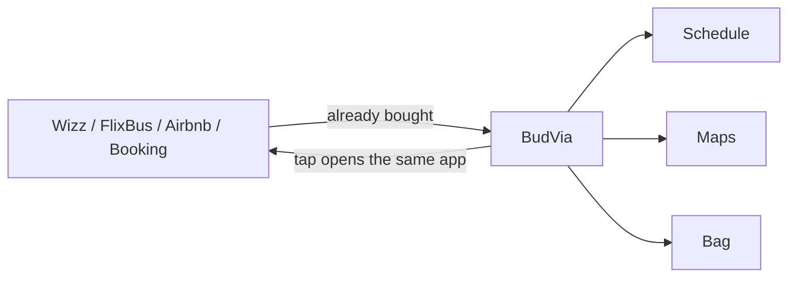

  

  
  
  

  
  
  

## Profil

Information Systems Engineer.

Nasıl kurulduğunu ve nereden kırıldığını anlamak için bakıyorum. Yazılım geliştirme ile sistemlerin gerçekte nasıl çalıştığını bir arada tutan bir eğitim aldım. Sunucu istemeyen bir işi sunucuya taşımam. Hesap istemeyen bir işe hesap eklemem.

Şu an üzerinde durduğum iş, ucuz tatili parçalayan uygulamaları tekrar tek bir plana çevirmek. Ürünün adı **BudVia**. Kaynak açık. Plan telefonda kalıyor.

[LinkedIn profili](https://www.linkedin.com/in/tahsinsakin) · Ankara

---

## BudVia

Bir haftalık tatilini ikiye mi bölmen gerekti?

Çok mu fazla biletin var?

Hepsini organize edemiyor musun?

**Tek bir uygulamada birleştirdim. Bu kadar basit.**

Ucuz tatil böyle kuruluyor. Uçak Wizz’de. Otobüs FlixBus’ta. Oda Airbnb’de ya da Booking’de. Şehir içi başka uygulamada. Akşam masası başka uygulamada. Her teyit ayrı kutuda. Her PNR ayrı mailde. Bir haftayı beş uygulamaya bölüyorsun. Sonra o beş parçayı tekrar bir trip haline getirmeye çalışıyorsun. Asıl yorulan yer orası. Bilet almak değil. Biletleri hatırlamak.

BudVia bilet satmıyor. Yeni bir rezervasyon sitesi de değil. Zaten aldığın şeyleri tek yerde tutuyor.

Üstüne üstlük hepsi uygulama içinden tık diye açılıyor. Bileti nereden aldıysan o uygulama açılıyor. Ayrı ayrı aramıyorsun. Tık. Gidebiliyorsunuz.

Ondan sonra trip duruyor karşında.

- Nerede başlayacak?
- Ne zaman başlıyor?
- Ne kadar erken gitmelisiniz?
- Ne zaman orada bulunmalısınız?

Tüm yolları gösteriyor. Saatleri gösteriyor. Çantayı gösteriyor. Sıradaki işi gösteriyor. Ve her şeyi çok basit yapıyor.

Hesap yok. Sunucu yok. Analitik yok. Plan bu cihazın üzerinde kalıyor.

  
  
  

### Ne işe yarar

| Ekran | Ne duruyor |
|---|---|
| Trip | Karşılama, uçuş kartı, sıradaki iş |
| Schedule | Tarihli hatırlatmalar, saatler |
| Places | Pin ve yol |
| Bag | Örnek çanta |
| Tickets | Wizz, FlixBus, Airbnb, Booking, MOL Bubi — tık, o uygulama |

### Nasıl açılır

1. Safari ile [tahsinsakin.github.io/belvia](https://tahsinsakin.github.io/belvia/) adresini aç.
2. Paylaş → **Ana Ekrana Ekle**.
3. Hesap istemez. Örnek trip yükle ya da kendi planını yaz.

Data `localStorage` key `belvia-v2`. Clear trip siler. Native App Store metni kaynak repoda: [`APP_STORE.md`](https://github.com/tahsinsakin/belvia/blob/main/APP_STORE.md).

English, one line: cheap tickets stay in the apps that sold them; BudVia keeps the itinerary on this iPhone.

---

## Şu an

| | |
|---|---|
| Building | [BudVia](https://github.com/tahsinsakin/belvia) — on-device travel companion |
| Live | [tahsinsakin.github.io/belvia](https://tahsinsakin.github.io/belvia/) |
| Publisher | [Tahsin Sakin · LinkedIn](https://www.linkedin.com/in/tahsinsakin) |
| Education | Ankara Bilim Üniversitesi — Information Systems Engineering |
| From | Ankara |
| Stack | TypeScript, Expo, React Native, PWA, local-first |
| License | MIT |

  

  
  

---

## İletişim

İş ve ürün yazışması için LinkedIn.

  

An idiot admires complexity, a genius admires simplicity.  
— Terry A. Davis

  

