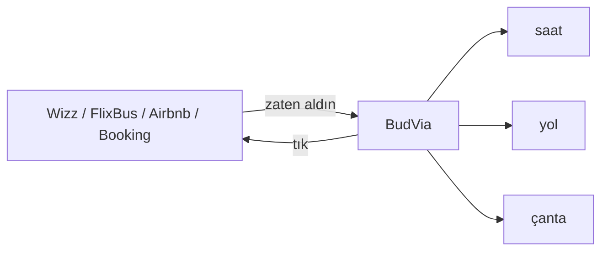

  

  
  
  

  
  
  

## Selam

Information Systems Engineer. Ankara.

Sistemin nasıl kurulduğunu da görürüm, nereden çatladığını da. Okul onu öğretti. Kafa onu sevdi. Fazlalık duran her şeyi keserim. Hesap istemeyen işe hesap koymam. Sunucu istemeyen işi buluta taşımam. Karmaşık duran şeyi karmaşık bırakmam.

Şu an masada duran şey **BudVia**. Ucuz tatilin dağıttığı beş uygulamayı tek plana çevirdim. Kaynak açık. Plan telefonda. Ben de buradayım.

Kısa versiyon: biletleri sen al. Hatırlamayı ben tutarım.

---

## BudVia — asıl iş

Tatili ucuza kuruyorsun. Güzel. Sonra evin dağılıyor.

Uçak Wizz’de. Otobüs FlixBus’ta. Oda Airbnb’de ya da Booking’de. Şehir içi başka yerde. Akşam masası başka yerde. Her teyit ayrı kutuda. Her PNR ayrı mailde. Bir haftayı beş uygulamaya bölüyorsun. Havalimanına çıkmadan önce o beş parçayı tekrar bir trip haline getirmeye çalışıyorsun.

Asıl yorulan yer bilet almak değil. Biletleri hatırlamak.

BudVia o dağınıklığı tek ekrana alıyor.

Satmıyor. Rezervasyon sitesi değil. Yeni bir Wizz değil. Zaten ödediğin şeyleri bir araya getiriyor. Tıkla: bileti aldığın uygulama açılıyor. Wizz Wizz olarak kalıyor. FlixBus FlixBus olarak kalıyor. BudVia onların üstüne çıkmıyor. Aralarındaki boşluğu kapatıyor.

Karşında trip duruyor. Tüm trip.

- Nerede başlayacak
- Ne zaman başlıyor
- Ne kadar erken çıkmalısın
- Ne zaman orada olmalısın
- Hangi yol
- Çantada ne var
- Sıradaki iş ne

Hesap yok. Sunucu yok. Takip yok. Mail istemiyor. “Üye ol” yok. Plan bu telefonun üzerinde duruyor. Silersen biter.

Bunu bu kadar sade yapmak için yazdım. Çünkü tatil zaten yeterince parçalı.

  

| Ekran | Orada ne var |
|---|---|
| **Trip** | Uçuş kartı. Sıradaki hamle. Bugün ne oluyor. |
| **Schedule** | Tarih + saat. “Sabah bir şey vardı” yok. |
| **Places** | Pin. Yol. Harita zaten telefonda. |
| **Bag** | Ne koydun. Ne unuttun. |
| **Tickets** | Wizz, FlixBus, Airbnb, Booking, Bubi. Tık. O uygulama. |

Üç adım:

1. [tahsinsakin.github.io/belvia](https://tahsinsakin.github.io/belvia/) — Safari
2. Paylaş → Ana Ekrana Ekle
3. Örnek tripi yükle ya da kendininkini yaz

Kaynak: [tahsinsakin/belvia](https://github.com/tahsinsakin/belvia)  
App Store metni orada duruyor. Bugün PWA yeter.

---

## Masada ne var

| | |
|---|---|
| Ürün | [BudVia](https://tahsinsakin.github.io/belvia/) |
| Kod | [github.com/tahsinsakin/belvia](https://github.com/tahsinsakin/belvia) |
| Okul | Ankara Bilim Üniversitesi — Information Systems Engineering |
| Şehir | Ankara |
| Stack | TypeScript · Expo · React Native · PWA · local-first |
| Kural | Sunucu yoksa sunucu yok |

  

  
  

---

## Yazışma

Ciddi konu LinkedIn’de. Şaka da orada durabilir. Bakarız.

  

An idiot admires complexity, a genius admires simplicity.  
— Terry A. Davis

  

